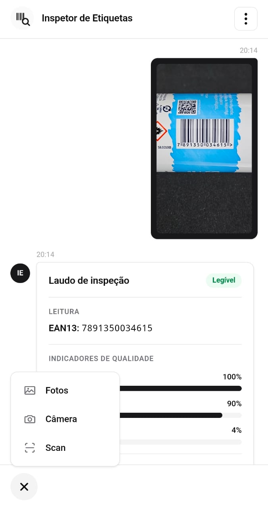
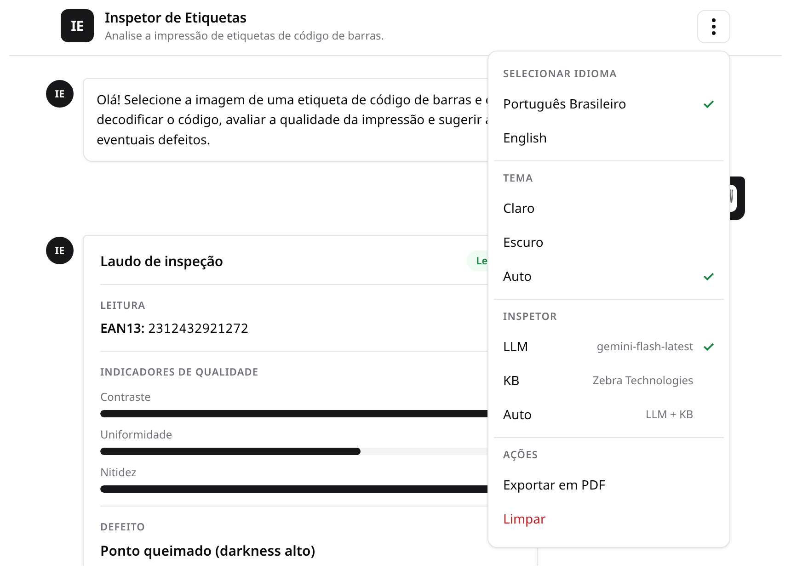
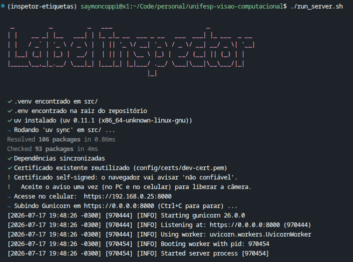

# Diagnóstico de defeitos de impressão em etiquetas de códigos de barras: uma abordagem por visão computacional e orquestração multiagente

### Trabalho da disciplina **Visão Computacional (cód. 2587)** — PPG em Ciência da Computação, ICT/UNIFESP.

Diagnóstico automático de falhas de impressão em etiquetas de código de barras a
partir de uma **foto**: o sistema lê o código, estima indicadores de qualidade,
**classifica o defeito** de impressão térmica e sugere a **causa provável** e a
**correção**. Combina visão computacional clássica (OpenCV + ZBar/pyzbar), uma
**CNN (MobileNetV3-Small, PyTorch)** e um **agente de diagnóstico com LLM (Google
Gemini)** — com a base de conhecimento Zebra por regras como *fallback*.

> **Não é um verificador certificado.** Os indicadores (contraste, uniformidade,
> nitidez) são *aproximações inspiradas* na ISO/IEC 15416 e não substituem a
> medição de um verificador óptico. O objetivo é apontar a **causa física
> provável** e a **ação corretiva** — o que uma nota A–F de verificador não faz.

## Como rodar

Use o lançador único **`./run_server.sh`** (na raiz do repo): ele roda `uv sync`,
gera um certificado TLS autoassinado (`config/certs/`) e sobe o gunicorn em **HTTPS**
(`https://0.0.0.0:8000`) — útil porque a câmera do navegador exige contexto seguro.

O modo de rede usa **gunicorn** com worker Uvicorn e `workers=1` — um único processo
mantém o contador de cota do Gemini (free-tier = 5 req/min) correto. Veja
`config/gunicorn.conf.py` e `config/inspector/ratelimit.py`.

Para o diagnóstico via **Gemini**, defina `GOOGLE_API_KEY` (ou `GEMINI_API_KEY`) em
`src/.env` (veja `src/.env.example` e `src/CONFIGURAR_GEMINI.md`). **Sem a chave o
sistema continua funcionando**: o diagnóstico cai para as regras da base Zebra.

## Interface

Chat web com envio de imagem e laudo estruturado (leitura do código, indicadores de
qualidade, defeito classificado com confiança, causa provável e correção sugerida).
Recursos reais da interface:

- **Anexar** (`+`) — **Fotos** (galeria/arquivo), **Câmera** (captura nativa) e
  **Scan** (leitor de código ao vivo via ZXing, com seleção de câmera e zoom).
- **Menu de configurações** (⋮):
  - **Idioma** — Português / English (interface e laudo internacionalizados).
  - **Tema** — claro / escuro / automático.
  - **Inspetor** — motor de diagnóstico: **LLM (Gemini)**, **KB Zebra Technologies**
    (regras) ou **Auto** (multiagente ADK com arbitragem visual; aparece só com LLM
    configurado).
  - **Ações** — exportar em PDF (imprimir) e limpar a conversa.
- Idioma, tema e motor escolhidos ficam salvos no `localStorage`; um rodapé mostra a
  **cota do Gemini** restante no minuto.

Se a imagem não contém um código de barras, o inspetor exibe apenas o aviso
correspondente — **sem executar a CNN nem chamar o LLM** (curto-circuito de presença).

## Sobre os três motores

- **KB (regras)** — determinístico, mapeia a classe da CNN → causa → ação pela base
  Zebra. Não usa rede nem chave.
- **LLM (Gemini)** — pipeline direto: o Gemini redige a causa/correção com o contexto
  da base Zebra; cai para as regras se a chamada falhar. É o padrão.
- **Auto (multiagente/ADK)** — percepção determinística (leitura + indicadores + CNN)
  seguida de um **árbitro visual multimodal** que só é acionado no par confundível
  `no_defect` ↔ `damaged_printhead_element` e de um diagnóstico fundamentado. Essa
  otimização mantém ~1–2 chamadas Gemini por análise para caber no free-tier
  (5 req/min); o grafo ADK completo também é exposto via `adk web`.

## Resultados (resumo)

CNN MobileNetV3-Small (~1,5 M parâmetros, ~4,5 ms em CPU) no conjunto de teste
sintético: **acurácia ≈ 0,84 / macro-F1 ≈ 0,84**. O ponto fraco é a confusão mútua
`no_defect` ↔ `damaged_printhead_element` (F1 ≈ 0,55) — as zonas claras entre barras
imitam as linhas brancas do dano na cabeça; é exatamente esse par que o árbitro visual
do modo Auto corrige. Detalhes, baselines (ResNet18, EfficientNet-B0) e testes de
significância (McNemar, k-fold) no artigo em `Research/`.

## Conclusão

Este trabalho propôs um sistema de detecção de defeitos de impressão em etiquetas de
códigos de barras que combina visão computacional e orquestração multiagente (ADK),
servido por uma API única e uma interface web multiplataforma, e que vai além da nota
tradicional ao sugerir a causa provável do defeito com base na documentação técnica do
fabricante. Respondendo à questão de pesquisa da Seção 4, os resultados indicam que é
viável, a partir de uma imagem de dispositivo comum, identificar defeitos típicos de
impressão com precisão suficiente para apoiar a decisão: o classificador atingiu boa
acurácia no conjunto de teste e F1 elevado na maioria das classes, com desempenho
estável sob validação cruzada e competitivo frente a arquiteturas de referência mais
pesadas — a um custo computacional muito menor.

A principal fragilidade da CNN-pura é a confusão entre "sem defeito" e "cabeça
queimada", cujas assinaturas visuais se assemelham — mitigada, no caminho ADK, por um
árbitro visual multimodal no agente de diagnóstico, recurso que a abordagem monolítica
não tem. O experimento E3 chegou a ser executado, mas ficou confundido pelo limite de
taxa da chave Gemini de nível gratuito (erros 429), de modo que a quantificação do
ganho permanece pendente de reexecução sem limite de taxa (Seção 6.4).

**Escopo real da dificuldade e o papel do árbitro.** Cabe uma ressalva honesta sobre a
escolha arquitetural. Um treinamento específico da MobileNetV3-Small, em pequena escala
e com poucas épocas, produziu, isoladamente, uma MobileNet inferior à ResNet18 e à
EfficientNet-B0; tomado sozinho, esse experimento não sustenta a preferência pela
MobileNet. Seu valor para a pesquisa é outro: ele reforça uma hipótese técnica robusta
ao evidenciar que a dificuldade está concentrada quase exclusivamente na separação
entre "sem defeito" e "cabeça queimada" (elemento da cabeça danificado). Todas as
demais classes exibem desempenho alto e consistente, independentemente da arquitetura —
ou seja, o desafio não é a classificação geral de defeitos, e sim a distinção entre
essas duas classes de assinatura visual muito semelhante. A progressão empírica de
escala de dados (Seção 6.5) mostra, ainda, que escalar dado real estreita essa
fronteira: o erro do par cai de ≈40% para ≈1,5%. Isso reposiciona o árbitro visual
multimodal como um refinamento sobre o resíduo dessa confusão, e não como uma
necessidade categórica do sistema.

**Principais contribuições entregues:**

1. o mapeamento sistematizado de defeitos visuais para causas físicas e ações
   corretivas, a partir da documentação Zebra;
2. a arquitetura multiagente que separa leitura, indicadores, defeito e diagnóstico;
3. o agente de diagnóstico fundamentado e multimodal, que vai além da nota e arbitra a
   classe da CNN nos casos visualmente confundíveis;
4. a avaliação experimental do classificador com métricas por classe, validação cruzada
   estratificada, comparação a *baselines* e teste de significância estatística.

**Trabalhos futuros:**

- ampliar o conjunto de dados com defeitos reais e quantificar o *domain gap*
  sintético→real;
- reexecutar o experimento E3 (ganho da arbitragem visual multimodal sobre a CNN-pura
  no par confundível) e a comparação quantitativa multiagente *versus* monolítica na
  qualidade do diagnóstico, ambos com chave de LLM sem limite de taxa e causas de
  referência rotuladas;
- executar o experimento E4 (generalização sintético→BarBeR) para comparação indireta
  com o estado da arte (DUAN et al., 2025);
- estender a símbolos 2D (Data Matrix/QR) via ISO/IEC 15415;
- aproximar os indicadores estimados de um verificador certificado por calibração;
- realizar avaliação em ambiente de produção.

## Capturas de tela

  

<em>No celular: menu de anexar (Fotos / Câmera / Scan) e laudo de inspeção legível — leitura EAN-13 e indicadores de qualidade.</em>

  

<em>Chat web e menu de configurações (⋮): idioma, tema, motor de inspeção (LLM / KB / Auto) e ações; ao lado, o laudo estruturado (leitura, indicadores e defeito).</em>

  

<em>Lançador <code>./run_server.sh</code>: <code>uv sync</code>, certificado TLS autoassinado e gunicorn em HTTPS (contexto seguro exigido pela câmera).</em>

